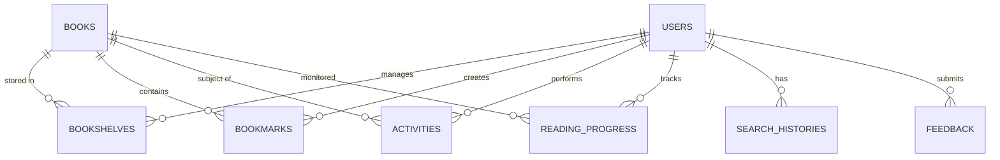

# 🍃 MongoDB Atlas Database Structure - E-Library

This document outlines the NoSQL database schema designed for MongoDB Atlas, powering the mobile backend of the E-Library system.

---

## 📊 Database Overview
- **Database Name:** `elibrary`
- **Host:** MongoDB Atlas (Cloud)
- **Architecture:** Document-oriented (NoSQL)

---

## 📁 Collections Schema

### 1. `users`
Stores user profile information and credentials.

| Field | Type | Description |
|-------|------|-------------|
| `_id` | ObjectId | Primary Key |
| `name` | String | User's full name |
| `email` | String | Unique email address |
| `password` | String | Bcrypt hashed password |
| `role` | String | User role (`user`, `admin`) |
| `avatarUrl` | String | URL to profile picture |
| `createdAt` | Date | Account creation timestamp |
| `updatedAt` | Date | Last update timestamp |

### 2. `books`
The central catalog of all available books.

| Field | Type | Description |
|-------|------|-------------|
| `_id` | ObjectId | Primary Key |
| `title` | String | Book title |
| `author` | String | Author name |
| `description`| String | Detailed summary |
| `category` | String | Genre (e.g., Fiction, Technology) |
| `coverUrl` | String | URL to book cover image |
| `pdfUrl` | String | URL to PDF file |
| `totalPages` | Number | Total page count |
| `isAvailable`| Boolean| Availability status |
| `isDeleted` | Boolean| Soft delete flag |
| `createdAt` | Date | Timestamp |

### 3. `bookshelves`
Stores user-specific book lists (Favourites, Reading List, etc.).

| Field | Type | Description |
|-------|------|-------------|
| `_id` | ObjectId | Primary Key |
| `userId` | ObjectId | Ref: `users` |
| `bookId` | ObjectId | Ref: `books` |
| `listType` | String | List name (`favourites`, `reading`, `completed`) |
| `status` | String | Progress status (`reading`, `finished`) |
| `addedAt` | Date | Timestamp |

### 4. `bookmarks`
User-created bookmarks within specific books.

| Field | Type | Description |
|-------|------|-------------|
| `_id` | ObjectId | Primary Key |
| `userId` | ObjectId | Ref: `users` |
| `bookId` | ObjectId | Ref: `books` |
| `pageNumber` | Number | Page where bookmark is placed |
| `note` | String | Optional user note |
| `createdAt` | Date | Timestamp |

### 5. `activities` (Reading History)
Logs of user interactions (Borrowing, Reading, Returning).

| Field | Type | Description |
|-------|------|-------------|
| `_id` | ObjectId | Primary Key |
| `userId` | ObjectId | Ref: `users` |
| `bookId` | ObjectId | Ref: `books` |
| `action` | String | Type of activity (`BORROW`, `READ`, `COMPLETE`) |
| `timeSpent` | Number | Time spent in minutes (for velocity tracking) |
| `timestamp` | Date | Timestamp |

### 6. `reading_progress`
Tracks the current reading position of a user in a book.

| Field | Type | Description |
|-------|------|-------------|
| `_id` | ObjectId | Primary Key |
| `userId` | ObjectId | Ref: `users` |
| `bookId` | ObjectId | Ref: `books` |
| `currentPage`| Number | Last page read |
| `totalPages` | Number | Total pages in book |
| `lastReadAt` | Date | Timestamp of last session |

### 7. `search_histories`
Personalized search history for each user.

| Field | Type | Description |
|-------|------|-------------|
| `_id` | ObjectId | Primary Key |
| `userId` | ObjectId | Ref: `users` |
| `query` | String | Search term used |
| `timestamp` | Date | Timestamp |

### 8. `feedback`
User feedback and bug reports.

| Field | Type | Description |
|-------|------|-------------|
| `_id` | ObjectId | Primary Key |
| `userId` | ObjectId | Ref: `users` |
| `type` | String | Feedback type (`bug`, `feature`, `general`) |
| `message` | String | Content of the feedback |
| `rating` | Number | Star rating (1-5) |
| `status` | String | Admin status (`pending`, `reviewed`) |
| `createdAt` | Date | Timestamp |

---

## 🔗 Relationships (ER Diagram)

---

## 🚀 Atlas Configuration Notes
1. **Indexes:** 
   - `email` in `users` is marked as **Unique Index**.
   - `userId` + `bookId` in `reading_progress` is a **Compound Index** for fast lookups.
2. **Security:** 
   - Network Access restricted to Render server IPs.
   - Database User has `readWrite` privileges only on `elibrary` DB.
3. **Storage:**
   - PDF files and high-res covers are stored in **AWS S3 / Firebase Storage**, with URLs stored in the MongoDB `books` collection.
